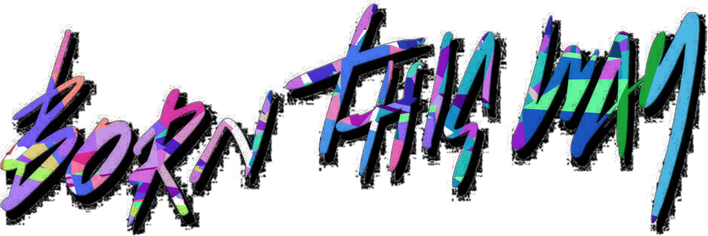
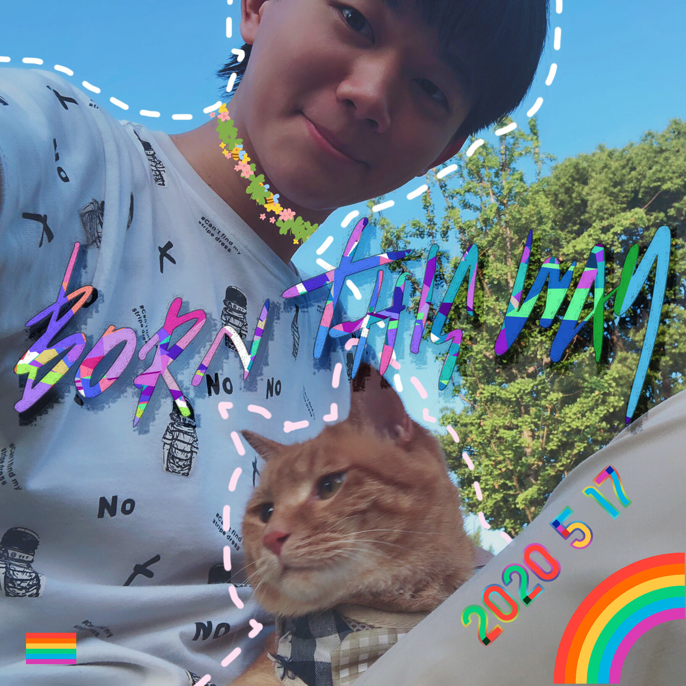

# IDAHOTB

> The International Day Against Homophobia, Transphobia and Biphobia is observed on May 17 and aims to coordinate international events that raise awareness of LGBT rights violations and stimulate interest in LGBT rights work worldwide
>
> 
<a href="https://en.wikipedia.org/wiki/International_Day_Against_Homophobia,_Transphobia_and_Biphobia">From Wikipedia</a>

_This a repo to backup &amp; show my self-made slogans and pictures for 517_

## 2020 517

